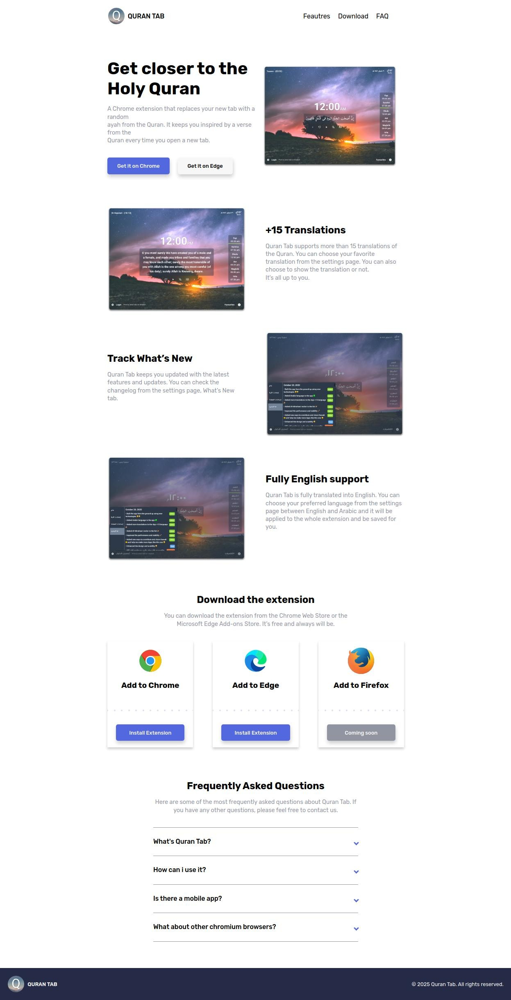
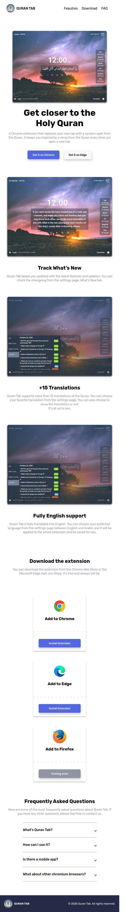

# QuranTab 🌙

This is the **front-end** part of **QuranTab**, a browser extension website built as an application for the **Almdrasa Diploma**.  
I focused on building a clean, responsive, and animated interface using **HTML, CSS, and Sass**.

---

## ✨ Features
- Fully responsive layout 📱💻
- Smooth **CSS animations**  
- Built with **Flexbox** and **CSS Grid**  
- Section-by-section development approach  

---

## 🚀 Live Demo

<a href="https://omarhazem02.github.io/Quran-tab-webpage/" target="_blank">👉 Click here to view the project</a>

---

## 🛠️ Process
1. Planned the **HTML structure** section by section.  
2. Applied styling using the best techniques (Flexbox, Grid).  
3. Added **CSS animations** to improve the user experience.  

---

## 📚 Resources
- **Almdrasa Diploma** course (big thanks ❤️)  
- **Mohamed Abusrea** – mentor and teacher 🙏  
- Official documentation  
- YouTube tutorials (CSS animation)  

---

## 🙏 Acknowledgment
Special thanks to **Almdrasa** and **Mohamed Abusrea** for guidance and mentorship.  

---

## 🔮 Future Development
- Build more websites like this – **faster & more efficient**  
- Improve my **CSS animation skills** ✨  

---

## 🖼️ Screenshot

### 🖥️ Desktop Version

### 📱 Mobile Version

